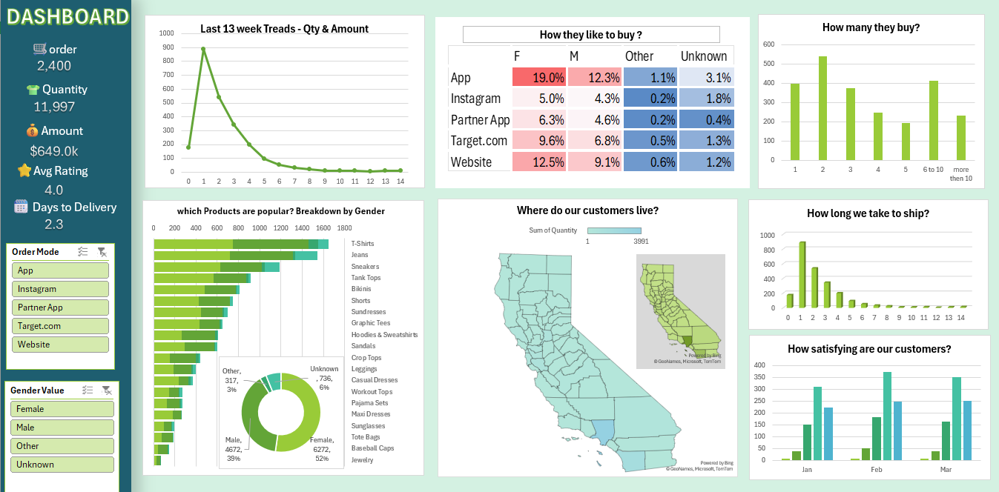

# 📊 E-commerce Sales Dashboard (Excel)

## 📌 Project Overview
This project is an interactive **E-commerce Sales Dashboard** built using **Microsoft Excel**.  
It helps analyze sales performance, customer behavior, delivery efficiency, and product trends using dynamic visuals and slicers.

---

## 🎯 Objectives
- Track overall sales performance (Orders, Quantity, Revenue)
- Analyze customer buying behavior by platform and gender
- Identify top-performing products
- Understand delivery timelines and customer satisfaction
- Visualize customer location distribution

---

## 🛠 Tools & Techniques Used
- Microsoft Excel
- Pivot Tables & Pivot Charts
- Slicers & Filters
- Data Cleaning & Formatting
- Conditional Formatting
- Dashboard Design Principles
- Basic Excel Formulas

---

## 📂 Dashboard Features
- KPI cards for quick performance overview
- Interactive slicers (Order Mode, Gender)
- Trend analysis for last 13 weeks
- Product-wise sales breakdown
- Location-wise customer analysis
- Shipping duration analysis
- Customer satisfaction trends

---

## 🖼 Dashboard Preview

---

## 🚀 How to Use
1. Download the Excel file
2. Open in Microsoft Excel (2016 or later recommended)
3. Use slicers to explore insights dynamically

---

## 📌 Author
**Banka Srimannarayana Reddy**

